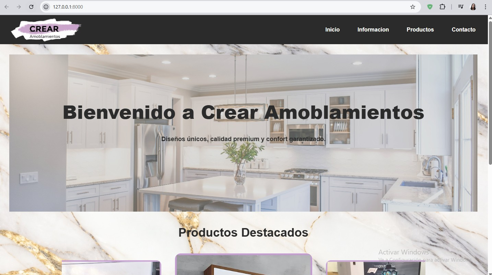
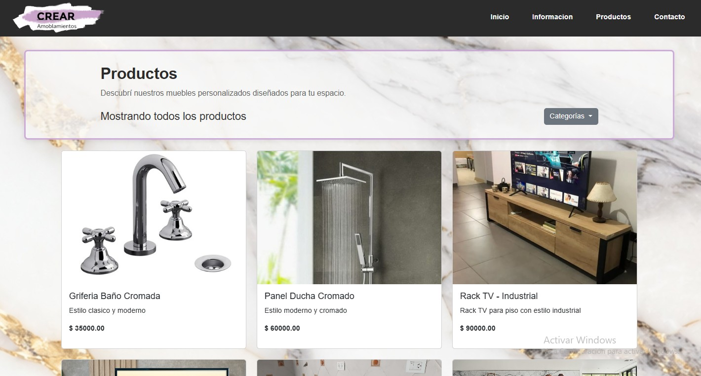

# Crear Amoblamientos Website

Official website for Crear Amoblamientos, a furniture design and manufacturing business based in Buenos Aires, Argentina. The site showcases custom furniture products, company information, and allows visitors to contact the business directly.

Live site: https://crear-amoblamientos-website.onrender.com/


---

## Overview

This project is a full-stack web application built with Django that presents the products and services of Crear Amoblamientos. It includes a product catalog with categories, a responsive interface, and a backend-powered contact form.

---

## Features

- Product catalog with categories
- Responsive design using Bootstrap
- Image gallery for products
- Contact form handled via Django backend (SMTP email sending)
- WhatsApp contact information
- Company information and history section
- Product filtering by category
- Cloud image storage using Cloudinary
- Production-ready static file handling with WhiteNoise

---

## Technologies Used

**Backend**
- Django 5.2
- Python 3.11
- Gunicorn (WSGI server)

**Frontend**
- HTML / CSS / Bootstrap / JavaScript

**Infrastructure**
- AWS EC2
- Nginx (reverse proxy)
- PostgreSQL (via `dj_database_url`)
- Cloudinary (media storage)
- WhiteNoise (static file serving)
- Gmail SMTP (email handling)

---

## Contact Form

The contact form is handled securely on the backend using Django and SMTP.
Form submissions are validated server-side, processed in the backend, and sent via Gmail SMTP — no exposed API keys, no client-side email services.

---

## Testing

The project includes automated tests for core functionality:

- **Email tests** (`tests/test_email.py`): verifies the contact form sends email on valid submission, skips sending on invalid input, and handles SMTP failures gracefully
- **Model tests** (`tests/test_models.py`): verifies Category and Product models, field constraints, relationships, and cascade behaviour

Run tests locally:

```bash
python manage.py test tests
```

---

SCREENSHOTS

### 🏠 Home


### 🏠 Catalog with db



---

## Project Structure

```
crear-amoblamientos/
│
├── .github/                        # CI/CD workflows
│
├── core/                           # Main app
│   ├── forms.py                    # Contact form
│   ├── views.py
│   ├── static/
│   │   └── core/
│   │       └── css/
│   │           └── styles.css
│   └── templates/
│       └── core/
│           ├── base.html
│           ├── contacto.html
│           ├── informacion.html
│           └── inicio.html
│
├── products/                       # Products & catalogue app
│   ├── models.py
│   ├── views.py
│   └── templates/
│       └── products/
│           └── productos.html
│
├── crear_amoblamientos/            # Project config
│   ├── settings.py
│   ├── urls.py
│   └── wsgi.py
│
├── media/                          # User-uploaded product images
├── staticfiles/                    # Generated by collectstatic (not in git)
├── tests/
│
├── docker-compose.yml
├── Dockerfile
├── manage.py
├── requirements.txt
├── runtime.txt
└── .env                            # Not in git


---

## CI/CD

This project uses GitHub Actions for continuous integration. On every push to `main`, the pipeline runs all tests automatically. Deployment is handled via AWS EC2.

---

## Local Setup

```bash
git clone https://github.com/YOUR_USERNAME/YOUR_REPO.git
cd crear-amoblamientos
python -m venv venv
venv\Scripts\activate      # Windows
pip install -r requirements.txt
cp .env.example .env       # fill in your environment variables
python manage.py migrate
python manage.py runserver
```